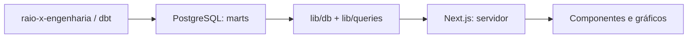

# RadarSUS — Dashboards do Raio-X Municipal

Aplicação web para explorar indicadores municipais de saúde, acompanhar a rede assistencial e comparar municípios do Rio de Janeiro. O RadarSUS apresenta os dados produzidos pelo projeto de engenharia em dashboards, gráficos, tabelas e relatórios executivos.

## Funcionalidades

- Visão geral por município e comparação entre municípios.
- Atenção primária: cobertura, equipes e indicadores.
- Rede CNES e produção ambulatorial.
- Financiamento e alertas priorizados.
- Relatório municipal, documentação metodológica e qualidade dos dados.

As páginas dependem das cargas e marts disponíveis no PostgreSQL. Competências e cobertura variam por fonte; ausência de dados não equivale a valor zero.

## Arquitetura



As consultas rodam no servidor. O código de conexão usa `server-only`, e as credenciais não devem receber prefixo `NEXT_PUBLIC_`. Regras centrais de transformação ficam no dbt; a aplicação organiza consultas e apresentação.

## Stack e estrutura

Next.js 16, React 19, TypeScript, Tailwind CSS, shadcn/ui, Recharts, PostgreSQL e Vitest.

| Caminho | Conteúdo |
|---|---|
| [app/](app/) | Rotas e composição das páginas |
| [components/](components/) | Layout, cards, gráficos, filtros e tabelas |
| [lib/db/](lib/db/) | Conexão PostgreSQL e configuração de timeouts |
| [lib/queries/](lib/queries/) | Consultas SQL isoladas da interface |
| [tests/](tests/) | Testes automatizados |
| [reference/](reference/) | Design system e referências visuais |
| [scripts/demo-video/](scripts/demo-video/) | Gravação da demonstração |

## Executar localmente

Pré-requisitos: Node.js 20.9 ou superior, npm e acesso a um PostgreSQL com os models do `raio-x-engenharia` carregados. Este repositório não cria nem preenche os marts.

```bash
git clone https://github.com/Moscarde/raio-x-front.git
cd raio-x-front
npm ci
cp .env.example .env.local
```

Configure `POSTGRES_HOST`, `POSTGRES_PORT`, `POSTGRES_DB`, `POSTGRES_USER` e `POSTGRES_PASSWORD`. O nome do banco deve coincidir com o usado pela engenharia; os exemplos dos repositórios usam nomes diferentes. Utilize uma role com permissões de leitura nas tabelas consultadas.

Os timeouts opcionais `POSTGRES_CONNECTION_TIMEOUT_MS`, `POSTGRES_QUERY_TIMEOUT_MS` e `POSTGRES_STATEMENT_TIMEOUT_MS` estão em [.env.example](.env.example).

```bash
npm run dev
```

Abra `http://localhost:3000`. Para diagnosticar falhas de dados, confira a conexão, os grants e as tabelas referenciadas em `lib/queries/`, especialmente no schema `marts`.

## Verificação e build

```bash
npx tsc --noEmit
npm run lint
npm run test
npm run build
npm run start
```

O build pode consultar o PostgreSQL ao gerar páginas. Ele precisa de conexão válida e dados disponíveis, mesmo que os testes unitários passem sem banco.

## Docker e demonstração

O [justfile](justfile) oferece `just setup`, `just check`, `just docker-build` e `just deploy`. O build Docker usa BuildKit e recebe `.env` como secret; o deploy foi configurado para execução no próprio servidor, com rede do host e porta `3067`. Revise esses parâmetros para seu ambiente antes de usá-los.

Para gerar o vídeo de apresentação, consulte [scripts/demo-video/README.md](scripts/demo-video/README.md). O comando disponível é `npm run demo:video`.

## Desenvolvimento e interpretação

Consulte [reference/design-system.md](reference/design-system.md), [reference/paginas.md](reference/paginas.md) e [notes/backlog.md](notes/backlog.md) antes de alterar a interface. As páginas de documentação e os models dbt descrevem metodologia e limitações dos indicadores.

Apresente dados agregados e preserve a referência temporal de cada fonte. Não versione arquivos de ambiente, credenciais ou dumps.

## Projetos relacionados

Este repositório faz parte do **Raio-X Municipal**, iniciativa independente de integração e análise de dados públicos de saúde. Os demais componentes são:

| Repositório | Papel no ecossistema |
|---|---|
| [raio-x-engenharia](https://github.com/Moscarde/raio-x-engenharia) | Coleta de fontes públicas, orquestração com Airflow e modelagem analítica com dbt. |
| [raio-x-database](https://github.com/Moscarde/raio-x-database) | Infraestrutura PostgreSQL, persistência, roles e rotinas de backup e restauração (repositório privado). |
| [raio-x-dash-evidence-dev](https://github.com/Moscarde/raio-x-dash-evidence-dev) | Protótipo anterior de apresentação analítica com Evidence.dev, Markdown e SQL. |
| [raio-x-lake](https://github.com/Moscarde/raio-x-lake) | Infraestrutura MinIO para object storage; a integração com o pipeline atual não está implementada. |

O fluxo implementado é fontes públicas → collectors/Airflow → PostgreSQL raw → dbt → marts PostgreSQL → apresentação. O MinIO é uma infraestrutura separada e não é requisito para executar o pipeline atual.
